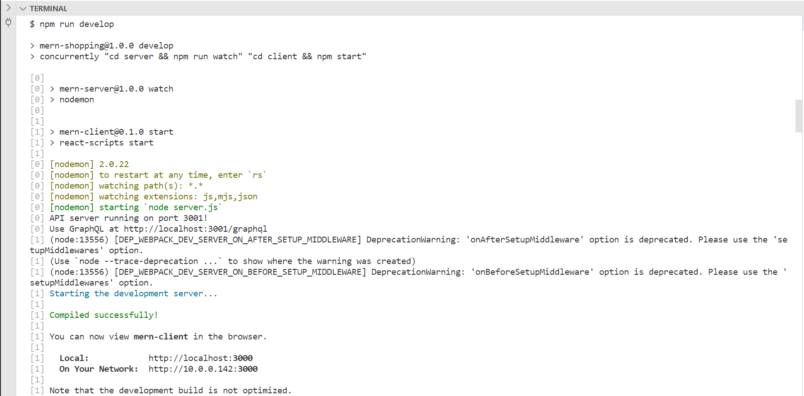
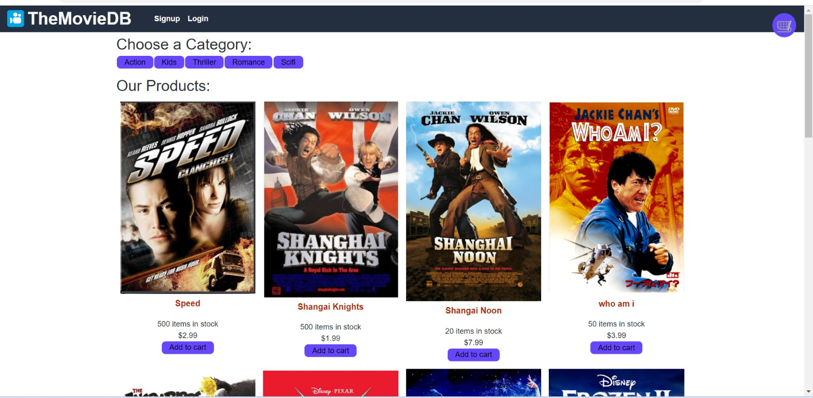
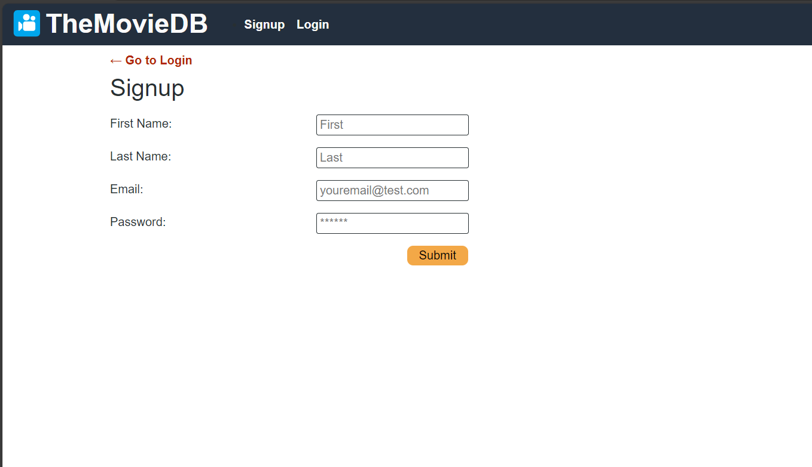
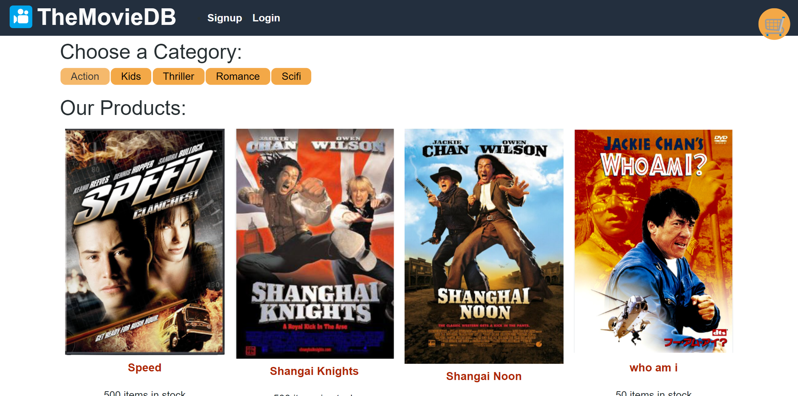
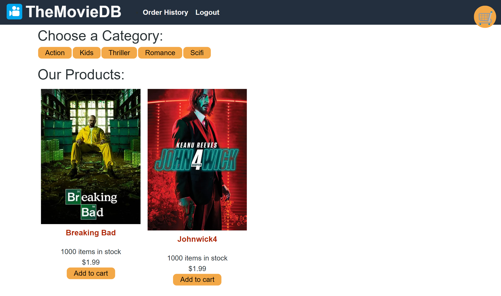

<div align="center">

# MovieDB_MERN

<p align="center">
    
    
    
    
    
    
    
    
    
</p>
 
</div>
# Description 
Introducing our comprehensive online movie database and e-commerce platform, where you can easily purchase your favorite films. Powered by the MERN Stack, our full-stack web application leverages the capabilities of React and Redux for a seamless user experience. With integrated Stripe payment processing, you can complete your transactions even in the event of a connection interruption. Additionally, our platform allows users to access their order history outside of the checkout process and offers convenient account creation and login functionalities. Explore, shop, and enjoy a hassle-free movie-buying experience with us.

 
The repository name is **MovieDB_MERN**

## Table of Contents

- [Technologies Used](#technologies-used)
- [Deployment](#deployment)
- [Usage](#usage)
- [References](#references)
- [License](#license)

## Technologies Used

- This application is a MERN stack application which is a group of four technologies, that is:-
  - MongoDB
  - Express.js
  - ReactJS
  - Node.js
- The MERN stack has a three-layer architecture based on Model-View-Controller pattern and each interconnected layer performs a specific function in the application:-

  | Client (View)          | React JS                   | User inputs data and Data display                        |
  | ---------------------- | -------------------------- | -------------------------------------------------------- |
  | **Server(Controller)** | **Express.js and Node.js** | **Method called to store and retrieve data in database** |
  | **Database(Model)**    | **MongoDB**                | **Stores raw data and contains no logic**                |

- As this application has come already with mostly pre-installed npm packages and is fully functioning Google Books API search engine built with a RESTful API and to refactor it to be a Graph API built with Apollo Server, the following additional npm packages were installed:-

        - npm i apollo-server-express
        - npm i graphql
        - npm i @apollo/client
        - npm i @apollo/react-hooks

* Before deploying to Heroku, the application is run in develop mode and tested using by entering at command prompt:-

  - npm install (ensure all that dependencies are installed)
  - npm init
  - npm run develop ( cd to the correct directory)

  

  - The URL of the functional deployed application is

  ## Usage

Below are the screenshots of the walkthrough steps the user (the avid reader) who want to search for new books to so that the user can keep a list of books to purchase.

- As the user of the application :-

```

GIVEN a Movies DB engine
WHEN we load the engine
THEN we are presented with a menu with different categories of movies  and Login/Signup and Cart(where all movies to be purchased are added)

```

- 

```
WHEN we click on the Login/Signup menu option
THEN a modal appears on the screen with a toggle between the option to log in or sign up
WHEN the toggle is set to Signup
THEN we are presented with three inputs for a username, an email address, and a password, and a signup button

```

- 

```
WHEN the toggle is set to Login
THEN we are presented with two inputs for an email address and a password and login button

```
- 


```
WHEN we enter a valid email address and create a password and click on the signup button
THEN the respective user account is created and I am logged in to the site
THEN the menu options change categories of movies,ordered history, and Logout
THEN we can search the movies based on the catergories
```

- 


```
THEN we are presented with five different Categories of movies 
Click on the desired categories 
Then we are presented with the movies belonging to that specific category
```

- Action Category

- 


- Kids Category

- 

- Thriller Category

- 


- Romance Category

- 

- Scienec-Fiction Category

- 


